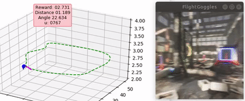

## Reinforcement Learning Experiments for FlightGoggles

This repository contains experiments for training trajectory-following and obstacle-avoiding policies in the FlightGoggles warehouse environment. By default, the action space is continuous, with actions interpreted as an angular velocity between `(-1, 1) rad/"step"`. Discrete policies are also supported.

### Installation

Anaconda is recommended:

```bash
conda env create -f resources/environment.yml
```

### Training

[Create an `experiment.yml` file using `yacs`](https://github.com/rbgirshick/yacs#usage) (you will need to call `cfg.merge_from_file("experiment.yml")` in `fgtrain.py`) or edit `config.py` and specify the location of your FlightGoggles binary:

```yaml
_C.FLIGHTGOGGLES.BINARY = "/path/to/FlightGoggles.x86_64"
```

Then, activate your conda environment and start training:

```bash
$ conda activate fgrl
(fgrl) python fgtrain.py
```

If you want to view the agent's performance in realtime, then in a second terminal run:

```bash
$ conda activate fgrl
(fgrl) python plot_train_fg.py
```

You should see the following output:




## Next steps

* Vehicle dynamics model
* Train depth-based policies
* Increase FPS for training (disable motion blur?)
* Note: there are several `TODO`s in the codebase indicating areas for improvement.
